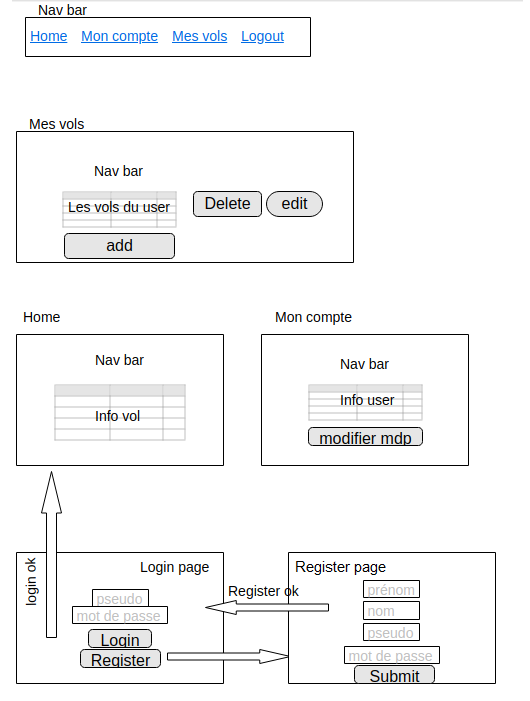

# Teaching-HEIGVD-AMT-2019-Project-One

## Introduction
Notre projet consiste en une application permettant à un pilote de gérer ses vols ainsi que de voir tous les vols qui existent, le pilote qui se connecte à notre base de donnée pour voir un résumé de ses informations et modifier son mot de passe, il peut modifier ses vols ou s'en ajouter un.

### Modélisation
Au début du projet nous avons utilisé ce concept de base de données


Nous avons ensuite pensé implémenter ce design de nos pages.



Dans le principe on souhaitait que l'utilisateur puisse accéder aux autres pages uniquement lorsque il sera connecté. Si ce dernier n'a pas encore de compte sur l'application, il pourra sélectionner le bouton register afin de créer son compte, une fois ce compte crée, il sera redirigé sur la page de login.

Une fois login, il accédera au home qui est une page affichant tous les vols de tous les pilotes, la nav bar permet de naviguer entre toutes les pages qui ont été crées.

La page mon compte affiche les informations du pilote et permet la modification du mot de passe

La page mes vols affiche tous les vols du pilote qui est actuellement connecté, ce dernier pourra les modifier, supprimer et en créer un nouveau

## Run project

Pour générer le .sql vous pouvez vous rendre dans le dossier /mysql-dummy-data et lancer cette commande
```
python main.py mysqldump_dump.sql --rows 1000000 --output ../data/output.sql
```
Vous pouvez spécifier le nombre de lignes à insérer à la suite --rows

Pour lancer l'infrastructure il vous suffit de vous rendre sur /topology-amt et de lancer la commande

```
docker-compose up --build
```
Vous aurez à ce moment une base de données SQL qui va se peupler toute seule ainsi qu'un serveur payara qui va charger notre application qui sera accessible à l'adresse
```
http://localhost:8080/Project-One
```

## Bug connu

Il se peut que lorsque vous saisissiez :
```
http://localhost:8080/Project-One
```
le login ne marche pas, comme discuté avec le professeur, il s'agit d'un bug connu qui va "ignorer le cookie". Afin de régler ça vous pouvez essayer de rentrer : 
```
http://<votre-ip>:8080/Project-One
```
"votre-ip" étant votre adresse IP.
