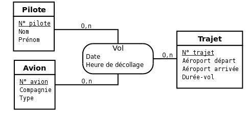
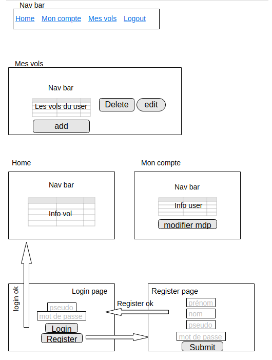
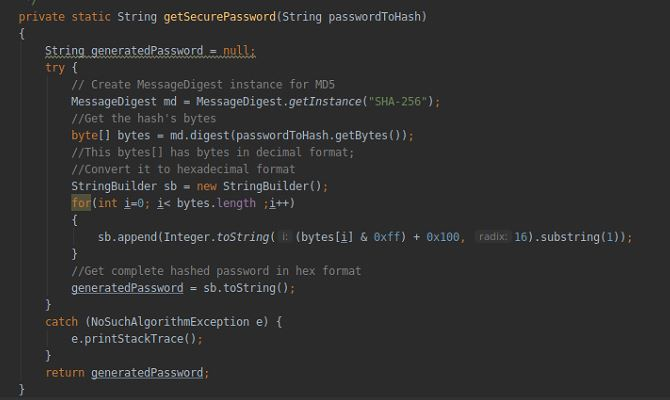

# Teaching-HEIGVD-AMT-2019-Project-One
## Modélisation
Au début du projet nous avons utilisé ce concept de base de données, nous avons par la suite rajouter les propriétés "pseudo" et "motdepasse" à la table pilote, afin qu'ils puissent se connecter à l'application.

Nous avons ensuite pensé implémenter ce design de nos pages.

Dans le principe on souhaitait que l'utilisateur puisse accéder aux autres pages uniquement lorsque il sera connecté. Si ce dernier n'a pas encore de compte sur l'application, il pourra sélectionner le bouton "Register" afin de créer son compte, une fois ce compte crée, il sera redirigé sur la page de "Login".

Une fois authentifié, il accédera au home qui est une page affichant tous les vols de tous les pilotes, la nav bar permet de naviguer entre toutes les pages qui ont été crées.

La page "Mon compte" affiche les informations du pilote et permet la modification du mot de passe

La page "Mes Vols" affiche tous les vols du pilote qui est actuellement connecté, ce dernier pourra les modifier, supprimer et en créer un nouveau

## Functional aspect

Par rapport à ce qui a été demandé nous permettons la modification, suppression et ajout de vol par l'utilisateur, il ne peut cependant pas modifier des informations sur un avion, un trajet. Par rapport à lui-même, le pilote peut modifier son mot de passe.

La navigation entre les pages est assez intuitive et a été implémentée dans le fichier "header.jsp" que l'on inclut dans chaque page jsp mise à disposition de l'utilisateur connecté.

Grâce au filter, l'utilisateur doit forcément être connecté afin d'accéder à des données. Lors de la création du compte depuis la page "Register", le mot de passe est chiffré en SHA256 et va effectuer les opérations suivantes :

On stockera le mot de passe de cette façon sur la base de donnée.

Dans la logique de notre Business domain, nous avons jugé intéressant le droit à l'utilisateur de voir tous les autres vols des autres pilotes, mais seul celui qui a été attribué à un vol peut effectuer des opérations dessus.
